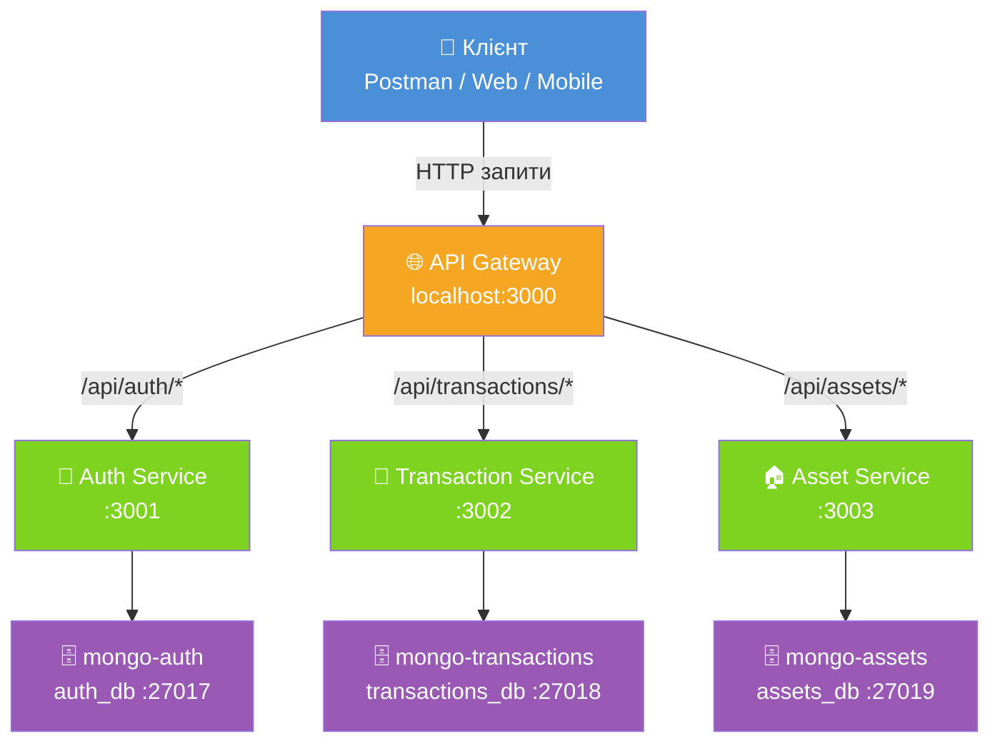
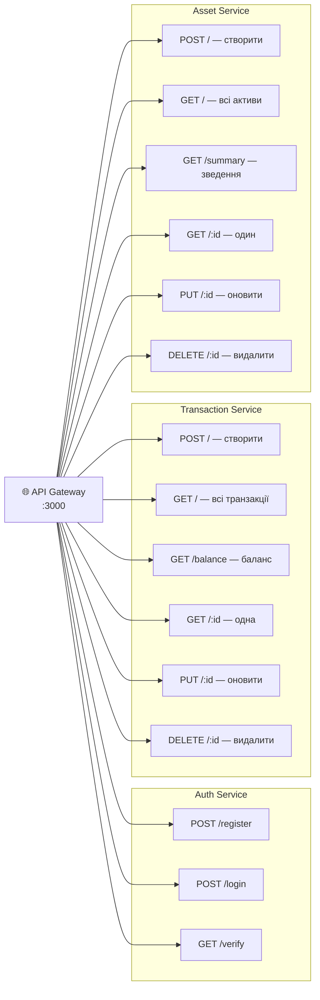
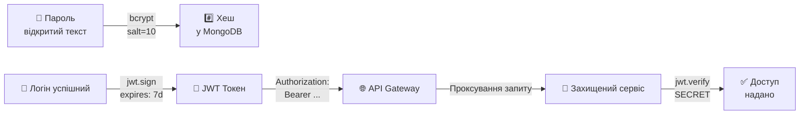

```mermaid
sequenceDiagram
    participant C as 👤 Клієнт
    participant G as 🌐 API Gateway
    participant A as 🔐 Auth Service
    participant T as 💸 Transaction Service
    participant DB1 as 🗄️ Auth MongoDB
    participant DB2 as 🗄️ Transactions MongoDB

    rect rgb(40, 60, 40)
        Note over C,DB1: Крок 1 — Логін та отримання токена
        C->>G: POST /api/auth/auth/login, body: { email, password }
        G->>A: POST /auth/login
        A->>DB1: findOne({ email })
        DB1-->>A: User document
        A->>A: bcrypt.compare(password, hash)
        A->>A: jwt.sign({ id }, SECRET)
        A-->>G: { token: "eyJ..." }
        G-->>C: { token: "eyJ..." }
    end

    rect rgb(40, 40, 60)
        Note over C,DB2: Крок 2 — Захищений запит з токеном
        C->>G: GET /api/transactions/transactions, Authorization: Bearer eyJ...
        G->>T: GET /transactions, Authorization: Bearer eyJ...
        T->>T: jwt.verify(token, SECRET) в authMiddleware
        T->>DB2: find({ userId })
        DB2-->>T: Transactions
        T-->>G: { transactions: [...] }
        G-->>C: { transactions: [...] }
    end
```

# 📊 Моніторинг персональних активів
### Дипломний проєкт — Мікросервісна архітектура на Node.js

---

## 📋 Анотація

Даний проєкт реалізує програмне забезпечення для моніторингу персональних активів на основі мікросервісної архітектури. Система дозволяє користувачам відстежувати свої фінансові транзакції (доходи та витрати), керувати персональними активами (нерухомість, транспорт, цінності) та отримувати зведену фінансову статистику.

---

## 🏗️ Архітектура системи

Система побудована за принципами мікросервісної архітектури, де кожен сервіс є незалежним застосунком зі своєю базою даних.

### Компоненти системи

| Компонент | Технологія | Порт | Призначення |
|-----------|-----------|------|-------------|
| API Gateway | Node.js + Express | 3000 | Єдина точка входу, проксування запитів |
| Auth Service | Node.js + Express + MongoDB | 3001 | Реєстрація, авторизація, JWT |
| Transaction Service | Node.js + Express + MongoDB | 3002 | Управління транзакціями, баланс |
| Asset Service | Node.js + Express + MongoDB | 3003 | Управління активами |
| mongo-auth | MongoDB 6 | 27017 | БД сервісу авторизації |
| mongo-transactions | MongoDB 6 | 27018 | БД сервісу транзакцій |
| mongo-assets | MongoDB 6 | 27019 | БД сервісу активів |

---

### Схема взаємодії компонентів



---

### Особливість маршрутизації

У проєкті маршрути через API Gateway мають подвійний логічний префікс. Перший префікс використовується Gateway для вибору потрібного мікросервісу, а другий належить внутрішньому роутеру самого сервісу.

Наприклад:

- `/api/auth/auth/register` — `/api/auth` визначає Auth Service, а `/auth/register` є внутрішнім маршрутом сервісу;
- `/api/transactions/transactions` — `/api/transactions` визначає Transaction Service, а `/transactions` є внутрішнім маршрутом сервісу;
- `/api/assets/assets` — `/api/assets` визначає Asset Service, а `/assets` є внутрішнім маршрутом сервісу.

Це дозволяє сервісам зберігати власну структуру маршрутів і працювати як через API Gateway, так і окремо під час локального тестування.

---



---

### Структура CRUD операцій



---

## 🛠️ Технічний стек

### Backend
- **Node.js 20** — середовище виконання JavaScript
- **Express.js 4** — веб-фреймворк для побудови REST API
- **Mongoose 7** — ODM для роботи з MongoDB
- **JSON Web Token (JWT)** — механізм авторизації без стану (stateless)
- **bcryptjs** — хешування паролів
- **http-proxy-middleware** — проксування запитів в API Gateway
- **express-rate-limit** — захист від DDoS атак

### База даних
- **MongoDB 6** — документоорієнтована NoSQL база даних
- Кожен мікросервіс має **власну ізольовану базу даних**

### DevOps
- **Docker** — контейнеризація сервісів
- **Docker Compose** — оркестрація мультиконтейнерного застосунку

---

## 📁 Структура проєкту

```text
personal-assets-monitor/
│
├── docker-compose.yml              # Оркестрація всіх контейнерів
├── .env.example                    # Приклад змінних середовища
├── README.md                       # Документація проєкту
│
├── api-gateway/                    # API Gateway — єдина точка входу
│   ├── Dockerfile
│   ├── package.json
│   ├── server.js                   # Проксі-маршрути до сервісів
│   └── .env
│
├── auth-service/                   # Сервіс авторизації
│   ├── Dockerfile
│   ├── package.json
│   ├── server.js
│   ├── models/
│   │   └── User.js                 # Модель користувача
│   ├── controllers/
│   │   └── authController.js       # Логіка реєстрації/логіну
│   ├── routes/
│   │   └── authRoutes.js           # Маршрути авторизації
│   └── .env
│
├── transaction-service/            # Сервіс транзакцій
│   ├── Dockerfile
│   ├── package.json
│   ├── server.js
│   ├── models/
│   │   └── Transaction.js          # Модель транзакції
│   ├── controllers/
│   │   └── transactionController.js
│   ├── middleware/
│   │   └── authMiddleware.js       # JWT перевірка
│   ├── routes/
│   │   └── transactionRoutes.js
│   └── .env
│
└── asset-service/                  # Сервіс активів
    ├── Dockerfile
    ├── package.json
    ├── server.js
    ├── models/
    │   └── Asset.js                # Модель активу
    ├── controllers/
    │   └── assetController.js
    ├── middleware/
    │   └── authMiddleware.js
    ├── routes/
    │   └── assetRoutes.js
    └── .env
```

---

## ⚙️ Встановлення та запуск

### Вимоги
- [Docker Desktop](https://www.docker.com/products/docker-desktop/) (включає Docker Compose)

### Запуск

**1. Перейдіть у папку проєкту:**
```bash
cd personal-assets-monitor
```

**2. Запустіть всі сервіси:**
```bash
docker compose up --build
```

**3. Дочекайтесь повідомлень:**
```text
✅ MongoDB підключено
🚀 Auth Service запущено на порті 3001
🚀 Transaction Service запущено на порті 3002
🚀 Asset Service запущено на порті 3003
🚀 API Gateway запущено на порті 3000
```

**4. Перевірте роботу:**
```bash
curl http://localhost:3000/health
```

### Зупинка
```bash
# Зупинити (зберегти дані)
docker compose down

# Зупинити та видалити всі дані
docker compose down -v
```

---

## 📡 API Документація

> **Базовий URL:** `http://localhost:3000`
>
> 🔒 Всі захищені запити потребують заголовку:
> `Authorization: Bearer <JWT_TOKEN>`

### Auth Service `/api/auth/auth`

| Метод | Endpoint | Захист | Опис |
|-------|----------|--------|------|
| POST | `/api/auth/auth/register` | ні | Реєстрація нового користувача |
| POST | `/api/auth/auth/login` | ні | Вхід, повертає JWT токен |
| GET | `/api/auth/auth/verify` | JWT | Перевірка валідності токена |

**Приклад реєстрації:**
```json
// POST /api/auth/auth/register
// Request:
{
  "username": "john_doe",
  "email": "john@example.com",
  "password": "securepass123"
}

// Response 201:
{
  "message": "Реєстрація успішна",
  "token": "eyJhbGciOiJIUzI1NiIs...",
  "user": {
    "id": "64f8a2b3c9d1e2f3a4b5c6d7",
    "username": "john_doe",
    "email": "john@example.com"
  }
}
```

### Transaction Service `/api/transactions/transactions`

| Метод | Endpoint | Захист | Опис |
|-------|----------|--------|------|
| POST | `/api/transactions/transactions` | JWT | Створити транзакцію |
| GET | `/api/transactions/transactions` | JWT | Всі транзакції |
| GET | `/api/transactions/transactions?type=income` | JWT | Фільтр по типу |
| GET | `/api/transactions/transactions/balance` | JWT | Баланс користувача |
| GET | `/api/transactions/transactions/:id` | JWT | Одна транзакція |
| PUT | `/api/transactions/transactions/:id` | JWT | Оновити транзакцію |
| DELETE | `/api/transactions/transactions/:id` | JWT | Видалити транзакцію |

**Приклад відповіді балансу:**
```json
// GET /api/transactions/transactions/balance
// Response 200:
{
  "totalIncome": 25000,
  "totalExpense": 3500,
  "balance": 21500
}
```

### Asset Service `/api/assets/assets`

| Метод | Endpoint | Захист | Опис |
|-------|----------|--------|------|
| POST | `/api/assets/assets` | JWT | Додати актив |
| GET | `/api/assets/assets` | JWT | Всі активи |
| GET | `/api/assets/assets?category=vehicle` | JWT | Фільтр по категорії |
| GET | `/api/assets/assets/summary` | JWT | Зведення по категоріях |
| GET | `/api/assets/assets/:id` | JWT | Один актив |
| PUT | `/api/assets/assets/:id` | JWT | Оновити актив |
| DELETE | `/api/assets/assets/:id` | JWT | Видалити актив |

**Категорії активів:**

| Код | Назва |
|-----|-------|
| `real_estate` | Нерухомість |
| `vehicle` | Транспортний засіб |
| `electronics` | Електроніка |
| `jewelry` | Ювелірні вироби |
| `investment` | Інвестиції |
| `other` | Інше |

---

## 🔐 Безпека



- Паролі зберігаються у вигляді **bcrypt хешу** (сіль 10 раундів)
- **JWT токени** мають термін дії 7 днів
- Кожен користувач має доступ **тільки до своїх** транзакцій та активів
- **Rate Limiting** на API Gateway: 100 запитів / 15 хвилин з однієї IP
- Сервіси спілкуються через **ізольовану внутрішню Docker мережу**

---

## 🧱 Принципи мікросервісної архітектури в проєкті

| Принцип | Реалізація |
|---------|-----------|
| Єдина відповідальність | Кожен сервіс відповідає за одну бізнес-функцію |
| Ізоляція даних | Кожен сервіс має власну базу MongoDB |
| Незалежне розгортання | Кожен сервіс має власний Dockerfile |
| API Gateway | Єдина точка входу для клієнтів |
| Stateless авторизація | JWT не потребує зберігання сесій |

---

## 👨‍💻 Автор

- **Студент:** Ковалишин Тимофій Едуардович
- **Група:** СП-42
- **Науковий керівник:** [ПІБ керівника]
- **Рік:** 2026
